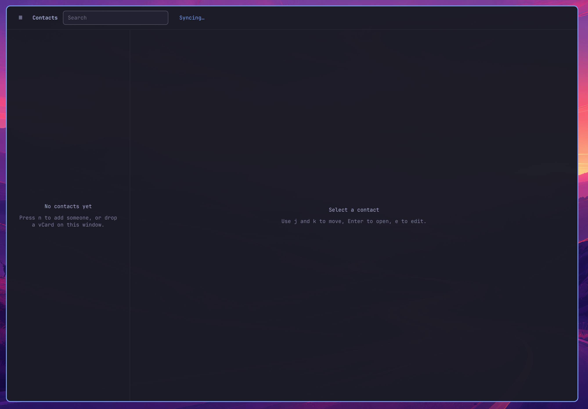

<p align="center">
  <a href="https://github.com/tcballard/omarchy-badges">
    
  </a>
</p>

# Contacts for Omarchy

A keyboard-first address book that lives in the Omarchy bar. Contacts are stored as vCard files on this machine. iCloud is optional.



Drop a window snapshot at `preview.png` (see [screenshots/](screenshots/)).

## Install

```bash
omarchy plugin add <repo-url>
cd ~/.config/omarchy/plugins/omarchy-contacts
make daemon
omarchy plugin enable omarchy-contacts
```

Then add the widget to the bar if it is not already there, and bind Super+C:

```lua
o.bind("SUPER + C", "Contacts", "omarchy-shell shell toggle omarchy-contacts '{}'")
```

`make daemon` builds the helper next to the QML. The helper is not shipped as a binary; it is compiled on this machine.

## Use

- Click the address-book icon, or press Super+C.
- `/` focuses search. Typing filters by name, phone, email, or organization.
- `j` / `k` or the arrow keys move the list. Enter opens a contact. `n` adds one. `e` edits. `d` deletes.
- `Ctrl+I` imports a `.vcf` file (macOS multi-card dumps work). `Ctrl+E` exports one.
- Drop a `.vcf` on the window, or into `~/.local/share/omarchy-contacts/import-drop/`.
- `?` shows every shortcut. Esc dismisses it, then search, then the window.

The theme colors the window. Changing theme recolors it live.

## iCloud (optional)

1. At [appleid.apple.com](https://appleid.apple.com) → Sign-In & Security → App-Specific Passwords, make a password for Contacts.
2. In the window, open iCloud, enter your Apple ID and that password.
3. Regular Apple ID passwords are rejected on purpose.

Sync is two-way. When both sides changed the same person, the later `REV` wins. A first pull of a large book with photos is slow; the window shows progress. The interval cannot go below two minutes.

The password is stored in the desktop keyring, not in a file.

## Where data lives

| What | Where |
|------|--------|
| Contacts | `~/.local/share/omarchy-contacts/contacts/` |
| Drop folder | `~/.local/share/omarchy-contacts/import-drop/` |
| Settings | `~/.config/omarchy-contacts/config.toml` |
| Sync log | `~/.local/share/omarchy-contacts/sync.log` |

One file per contact. Killing the helper is fine: the next search, click, or keystroke starts it again.

## Keyboard (defaults, overridable in config.toml)

| Key | Action |
|-----|--------|
| Super+C | Open |
| / | Search |
| Esc | Close search / overlay / window |
| ↑ ↓ or j k | Move the list |
| Enter | Open selected |
| n | New |
| e | Edit |
| d | Delete |
| s | Sync now |
| Ctrl+I / Ctrl+E | Import / export |
| Tab | Next field while editing |
| Ctrl+S | Save |
| ? | Shortcut list |
